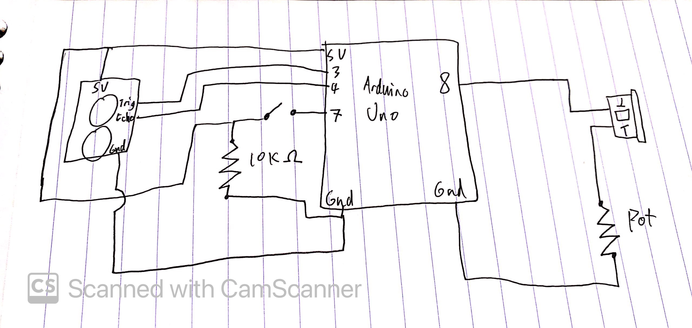

# November 17 - Musical Instrument

[Video Demo](https://www.youtube.com/watch?v=LP8uWqnD_Nw&feature=youtu.be)

I made a theremin(ish)! While the button is pressed, a note plays. The pitch of that note is determined by the distance of your hand from the distance sensor. The pitch snaps to notes within one octave of the C major scale, to avoid weird fluctuations in pitch. The instrument uses a buzzer and also has a volume knob.

While the distance sensor provided in the kit is quite jumpy and unstable, it's still fun to play around with. I had to do a bunch of work (like constraining the distance variable and then mapping to C major notes) to make the theremin usable, and even then you can still notice it fluttering between notes.

Schematic:
