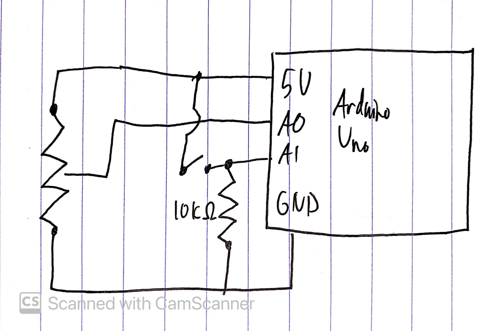

# November 24 - Arduino/Processing Communication Prototype

For this week, I made a simple game prototype where the player has to deflect incoming balls using a shield. The shield gets smaller and smaller as the player fails to block balls, until eventually the game ends.

The game uses a potentiometer and a button through Arduino and reads the serial input to control the character.

I'm hoping for this to be a starting point for my final project. There are a lot of ways I could expand on this idea. The main thing I'm thinking of right now is turning it into a rhythm game, where the bullets firing are kicks and the deflections are snares. I'm also thinking it could be a different version of Pong. One challenge is that the potentiometer isn't continuous, so it's a little awkward to control the angle of the shield. Maybe I could make my own continuous knob or something.

Video demo: [linked here](https://drive.google.com/file/d/1Br94h9xjNaEC82mAstvNfd3ZLSeEnVra/view?usp=sharing)

Schematic:
