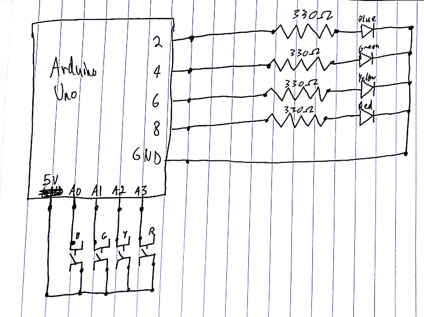

# November 3 - Reaction Game with Arduino
A simple game made with Arduino. LEDS light up repetitively. Press the corresponding button when a light turns on to score a point. All the LEDs light up when you press correctly. It's more of a reaction game than a puzzle, but I found the project interesting because instead of just going through each LED for every iteration of `loop()`, I had to iterate over an array of pins and check for a single color-specific button press for every loop.

Schematic:

