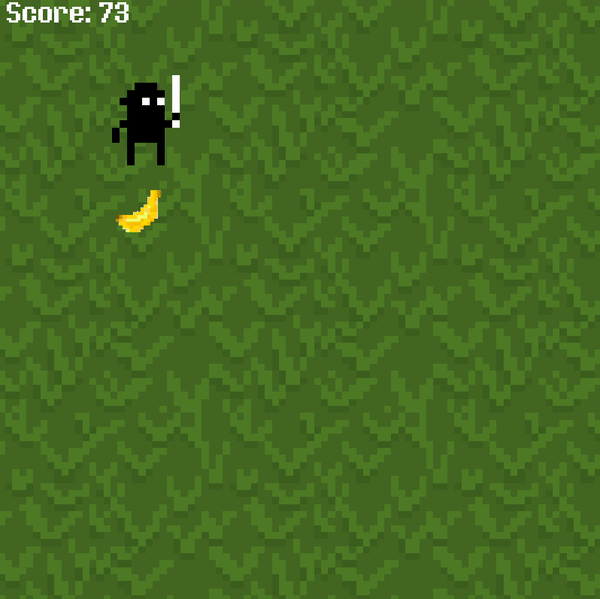

# Assignment 5 - Fruit Ninja

I made the fruit ninja game, except the ninja just likes eating fruit.

### Image Manipulation
I found some 8-bit game assets at [opengameart.org](opengameart.org) and sliced the spritesheets to get these animations. The ninja does a cute bouncing animation when stationary and has a walking animation.

I also found a spritesheet of 9 different 8-bit fruits. A random fruit respawns (chosen from the spritesheet) every time the ninja picks fruit up.

Processing is absolutely terrible with image loading errors (it just freezes and I have to use Task Manager to force-quit it) so development wasn't the smoothest. At the very least, I learned to force myself to not have image loading errors while testing so I wouldn't have to deal with the horrendous crashes.