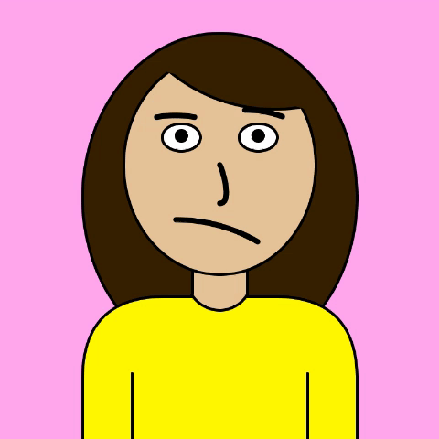

# Assignment 1 - Self-Portrait

A self-portrait drawn using basic shapes in Processing.

### Project Notes
The most tedious part of this project was eyeballing the coordinates for shapes. I had to put numbers in, compile and run the code, see if there were any misalignments, then repeat the process until the shape ended up where I wanted it.

To fix this problem, I added the line `print(mouseX, mouseY)`. This way, I could run the canvas and put my mouse where I wanted a shape to be, then read the console to know what coordinates my shapes needed. This saved me a bunch of time since I no longer had to guess what coordinates would work and keep tweaking the values until I got what I wanted.

Aside from that, I found the static portrait a bit boring so I used the `map()` function to make the pupils follow the mouse. 

### Challenges
The project was fairly easy but more time-consuming than I expected. 