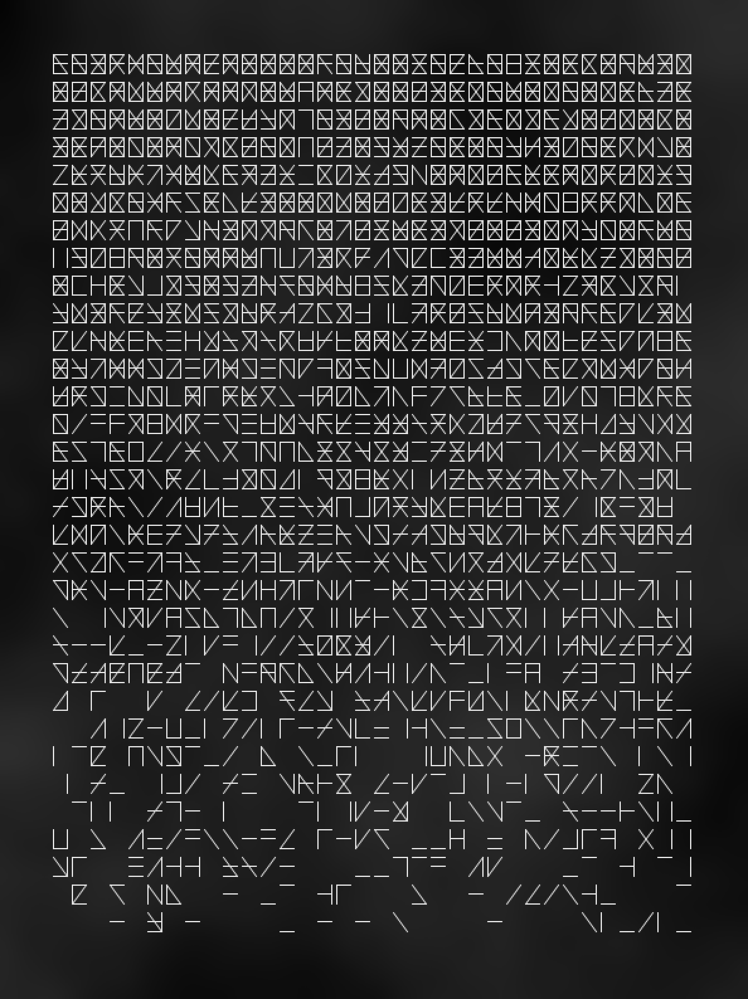
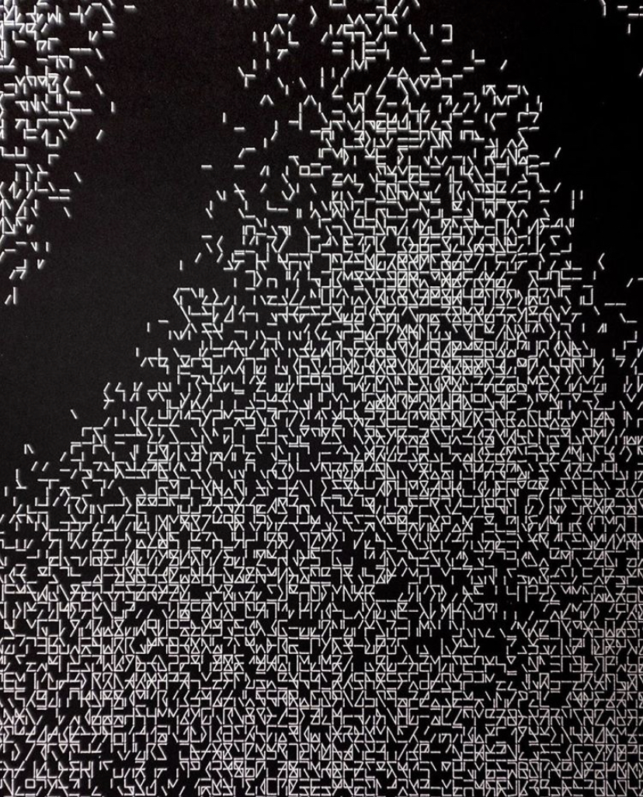

# Assignment 3 - Object-Oriented Art

This sketch was meant to be a simulation of some kind of alien writing system. To do so, I created a "glyph" object which is a rectangle with 6 points. I then drew each object with a bit of randomness.

The piece was inspired by this post from @revdancatt on Instagram:

### Learnings
Using OOP was useful here so I could have a class-based function to draw an individual glyph. After that, it was just a matter of looping through an ArrayList of glyph objects.

I also generated a bit of Perlin noise in the background to add some interest.
