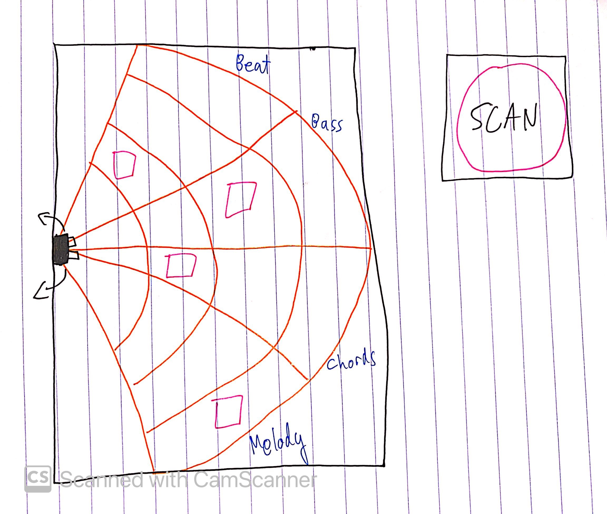

# Final Project Concepts:

### Sonar DJ
My first idea is an interactive electronic music production kit. 

A distance sensor is mounted on a servo. The area in front of the distance scanner is the audio space. When you put cubes on different parts of the space and hit SCAN, the distance scanner scans its surroundings and plays music based on the positions of the cubes.

My idea right now is for the audio space to have 4 different channels, where each channel controls a particular part of the music (as of now, beat, bass, chords, and melody). I also want to add more expressive ways to vary sounds, maybe with different kinds of sensors.

### Rhythm combat game 

See [Nov 24 assignment](https://drive.google.com/file/d/1Br94h9xjNaEC82mAstvNfd3ZLSeEnVra/view)

Each ball launched is a kick drum, each one destroyed is a snare. Would be cool to compose a soundtrack and levels for this