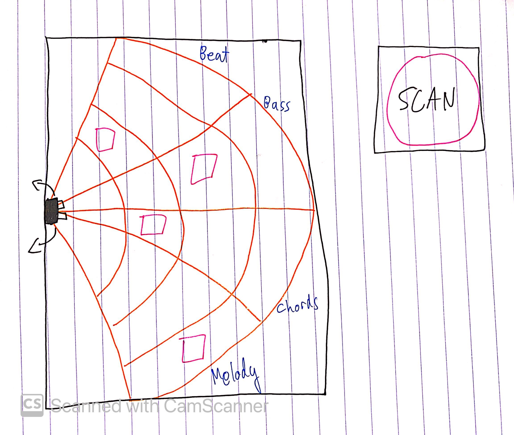
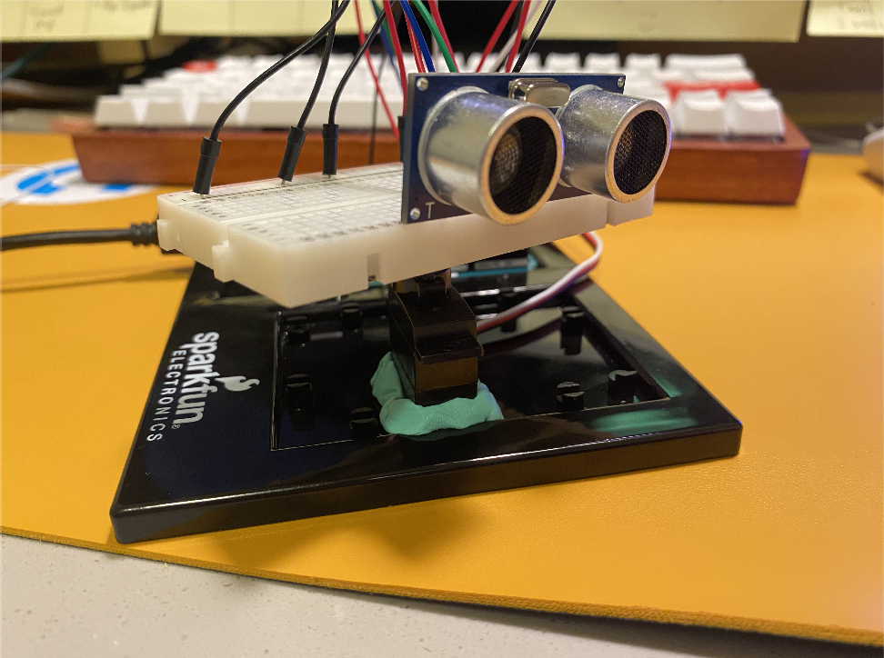
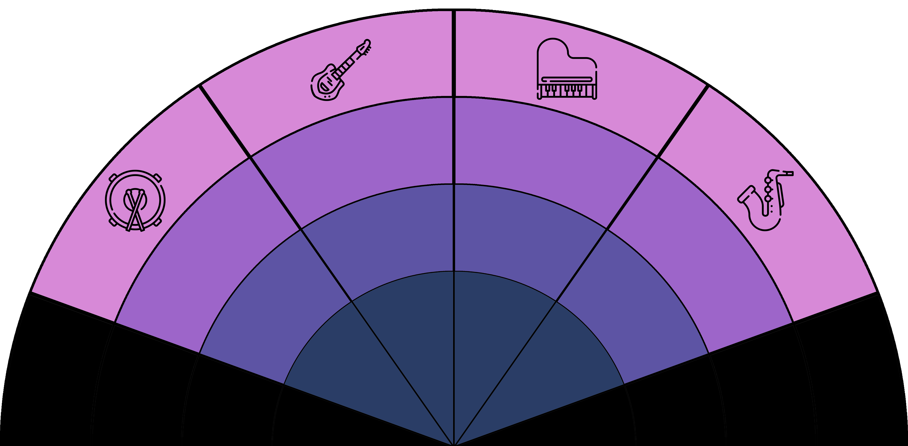

# Final Project: Sonar DJ

Sonar DJ is an interactive electronic music kit. 

[Live demo link](https://www.youtube.com/watch?v=uY-fv90nOMc&feature=youtu.be)

### November 25

A distance sensor is mounted on a servo. The area in front of the distance scanner is the "audio space", which is a labelled mat with different channels. When you put cubes on different parts of each channel and hit SCAN, the distance scanner scans its surroundings and plays music based on the positions of the cubes.

My idea right now is for the audio space to have 4 different channels, where each channel controls a particular part of the music (as of now, beat, bass, chords, and melody). I also want to add more expressive ways to vary sounds, maybe with different kinds of sensors.

### December 4

Finished the basic physical prototype of the scanner! Mounting a breadboard onto a tiny servo, with a bunch of wires messily stuck on, makes stable motion and sensing quite difficult. Major takeaway from today: large amounts of Blu-Tack can solve anything. 

I did have an idea for the instrument. Instead of having cubes on a mat that you just move around, it would be cool to control the instrument by moving your hands across the mat. This makes the instrument less likely to be played for longer periods of time, since people's hands will probably get tired. Plus, having human hands on the mat instead of cubes will make sensing much less accurate. I'll sleep on it and think about what makes sense.

### December 9

Finally finished the project! Today I worked on:
>Composing music loops for the instrument in Logic
>Controlling music with the distance sensor
>Coding audio visualizations with Fast Fourier Transforms
>Designing & printing a mat for the instrument

The distance sensor can get pretty wonky, so what I did was get the closest distance reading for each angle range (so that I could use a thin object like a ballpen to trigger specific sounds without accidentally triggering others). 

I also made a mat for the instrument to show the user what instruments there are and how to get different sounds out of them. Each "zone" in the mat has a specific musical loop associated with it, so you can play around with different loops from each instrument.

