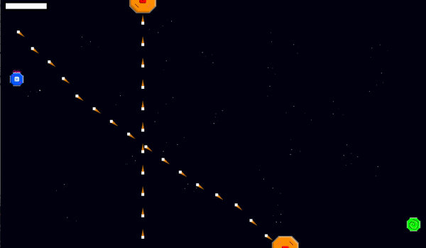
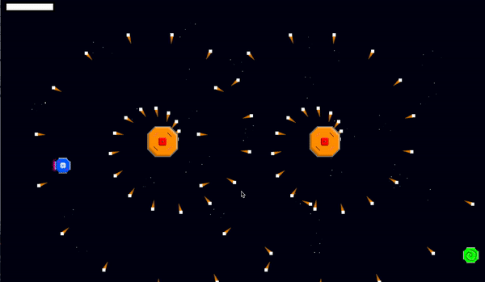
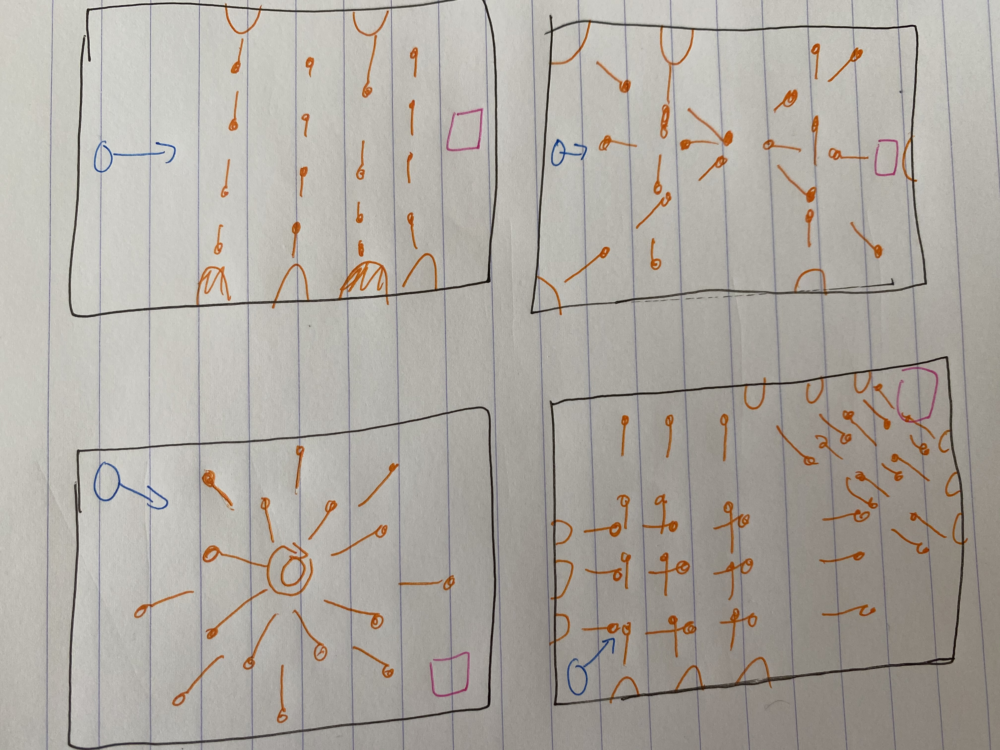
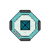
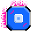
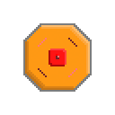

# Bullet Time

Bullet Time is a difficult but fair bullet hell that lets you slow time down. 

I've always been fascinated by hard games, even though I'm not very good at them. What entices me about them is the feeling of invincibility one gets after failing a level over and over, and then succeeding in the end. In Bullet Time, I strove to make the game feel incrediby difficult but also fair and forgiving.

I created pixel art for the first time during this project. I also composed the soundtracks and sound effects myself.

In Bullet Time, you pilot a ship (with WASD/arrows) towards a portal, while dodging an onslaught of bullets from enemies. While playing, you can slow down time using the SPACE key. This consumes a limited Slow Meter (in the top left) that slows both the bullets and your ship, allowing you to perfectly time and execute tight maneuvers.

There are three main enemy types in the game:

### Regular

These enemies shoot bullets in a straight line. They are fairly easy to get around once you get the hang of the basic mechanics.

### Sniper

These enemies aim at your ship and shoot bullets in its direction. Don't stay in one part of the map too long, or else the bullets will catch up with you.

### Berserker

These enemies fire bullets in a constant spiral pattern. You'll have to make clever use of your ship's movement as well as the Slow Meter to get past them.

This game was inspired by the first-person shooter [Superhot](https://superhotgame.com/) as well as the bullet hell [Bullet Fractals](https://nartier.itch.io/bullet-fractals).

## Journal of progress:

### October 15
Inspired by the first-person shooter [Superhot](https://superhotgame.com/) as well as the bullet hell [Bullet Fractals](https://nartier.itch.io/bullet-fractals), I want to make a side-scrolling "[bullet hell](https://en.wikipedia.org/wiki/Shoot_%27em_up)" game where the player can slow down time to dodge bullets and precisely control their character. One of the main features I want to implement is a catchy, upbeat original soundtrack that also slows down when the player slows time.

Today I began composing the soundtrack for the game and implementing some basic things in Processing. I was able to finish a draft of the soundtrack and get smooth transitions between fast/slow music using the `processing.sound` library. 

Unfortunately I can't find a way to only modify pitch or speed – I have to change both when I change the sound file's `.rate()`. This seems to be true for p5.js as well, so I'll just have to live with it.

### October 18
I polished the soundtrack of the game, adding more variation and tonality so the player doesn't get tired of it. I also ported what I have so far of my project onto p5.js. I realized that this is something I'd want to easily share with others once it's done, which is why I want it to live in a browser window instead of a Processing sketch.

I also did a bit more thinking about what I want the gameplay to be like. I figure it would be interesting for the game to last infinitely, with difficulty scaling automatically as time moves on. I can procedurally generate more and more enemies as the player lives longer. 

Thinking about the visual aesthetic of the game, I want it to match the techno-y, funky vibe of the soundtrack I wrote. I should probably use lots of purples and blues for the color palette, to fit a cyberpunk-esque theme. I also think 8-bit sprites would be a good fit for the game's mood.

### October 24
As a complete 180 from my last journal entry, I've decided to move forward in Processing instead since file loading and keyboard input things are just easier to deal with in Java. If I really want to share the project, I can just use processing.js or something later on.

I figured I should start thinking more critically about level design, so I drew up level mockups on pen and paper. 

I want to introduce new mechanics or techniques every level, so I have to gradually increase difficulty, making sure not to shock the player.

I was able to write win & loss sound effects for when the player reaches the portal or dies from a bullet.

I also put together a basic prototype for one level of the game. The prototype has most of the game's basic functionality: smooth and controlled movement (which I had to tweak quite a bit), the time-slow function, music that also slows with the game, a ship, a bunch of shooters, bullets, and a portal as the goal. 

Processing is notoriously bad at rendering lots of objects simultaneously. While I didn't experience any lag with this prototype, I know I will eventually the more complex my game gets. To get around this, I designed the `cleanBullets` function to dynamically delete `bullet` objects from the `bullets` ArrayList. Once the bullet leaves the screen, it no longer gets displayed or checked for the death condition. This means that `checkDeath` only iterates through a small array at any given frame; with the cleaning function, it only iterates through around 30-50 bullets, while without it, that number could easily reach the hundreds or thousands.

Finally, I started working on some pixel art for the sprites. I've never really done pixel art before but I found it fairly intuitive and fun. Here are some sprite samples:

 

Anyway, after seeing how much work I got done on the prototype, I decided to stop working for the day.

### October 25

I playtested the game with some friends and found out a few things. First, the game is a lot harder than I thought it was for people less experienced with games (although that's a good thing! I want it to be hard.) Some of the playtesters who are more used to games were quickly able to get a hold of the mechanics, though. I was planning on making it even harder but I'm now reconsidering that. I definitely don't want it to be easy, but I also don't want people to quit after 3 tries.

### October 26

Crunch time!

I added so many new things:
* A "meter" for the slow ability, so that people don't just spam it
* Title screen and menu
* All 12 levels (!!)
* 2 unique types of shooters: a Sniper that shoots in your direction, and a Berserker that shoots in a spiral around itself
* And new pixel art that isn't as ugly:

  

